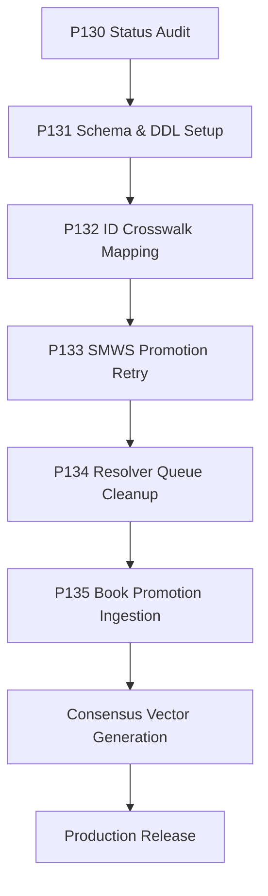

# Next Phase Plan & Ingestion Strategy

This document outlines the exact execution roadmap and dependency structure to resolve blockers and move towards the next release.

## Dependency Graph

## Description of Next Phases

### 1. P131 — Schema & DDL Setup
- **Objective:** Fix D1 target database readiness by bootstrapping `output/import/knowledge.db` with the bootstrap schema. Add required columns (`source_key`, `source_citation_id` to `citations`; `smws_code`, `rich` to `canonical_vectors`).
- **Dependencies:** P130 (this audit).
- **Complexity:** Low.

### 2. P132 — ID Crosswalk Mapping
- **Objective:** Build a deterministic mapping table/crosswalk between `production.db` UUIDs and `knowledge.db` legacy W-ids. This resolves the ID-space mismatch and enables target-consensus joins.
- **Dependencies:** P131.
- **Complexity:** Medium.

### 3. P133 — SMWS Promotion Retry (P128 Resolve)
- **Objective:** Retry the P128 promotion gate. Load the 726 SMWS MERGE vectors and tasting notes into the newly bootstrapped `knowledge.db` using the UUID-to-W-id crosswalk. Cleanly route the 77 ambiguous codes to the review queue.
- **Dependencies:** P132.
- **Complexity:** Low.

### 4. P134 — Resolver Queue Cleanup
- **Objective:** Develop a script to filter out noise from the 30,529 book entity candidates. Auto-reject records below a 0.70 confidence threshold and partition remaining candidates for human verification.
- **Dependencies:** P133.
- **Complexity:** High.

## Recommendation for Next Phase
The single highest-priority next implementation phase is **P131 — Schema & DDL Setup**. This phase lays the foundation by establishing a valid target `knowledge.db` schema, which is a hard prerequisite for resolving all other data ingestion blockers.
